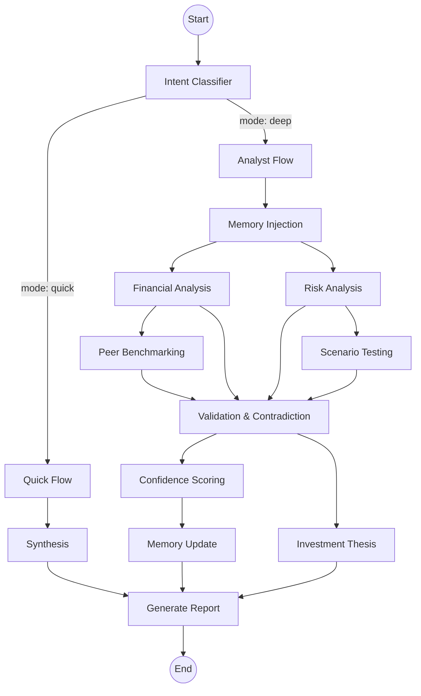

# Financial Research Agent 🚀

A high-performance, multi-agent system built with **LangGraph** designed for sophisticated financial analysis, market research, and investment thesis generation. This project leverages a local **Ollama** gateway for private, efficient LLM processing.

## 📖 Overview

The Financial Research Agent automates the workflow of a junior equity analyst. It routes queries through a directed acyclic graph (DAG), where each node specializes in a specific part of the research process—from parsing intent to stress-testing financial assumptions.

### 🏗 Infrastructure: Ollama Gateway
Unlike projects dependent on external APIs (like OpenAI), this agent uses a **locally hosted Ollama instance**:
- **Gateway**: `http://localhost:11434/api/generate`
- **Model**: `llama3.2:3b` (default)
- **Integration**: Handled via `utils/llm.py` using standard REST requests for maximum control and zero external data leakage.

---

## 📂 Project Structure (44+ Files)

```text
financial_research_agent/
├── .dockerignore           # Exclusions for Docker builds
├── .env                    # Local environment config (Ollama URL, HF Keys)
├── .gitignore              # Comprehensive rules for Python and IDEs
├── Dockerfile              # Container definition for the agent
├── README.md               # Extensive project documentation
├── graph.py                # Core LangGraph orchestration logic
├── main.py                 # Application harness for testing and execution
├── pyproject.toml          # Modern Python packaging and dependency config
├── requirements.txt        # Legacy dependency list
├── state.py                # Typed ResearchState (the 'brain' of the agent)
├── uv.lock                 # Strict dependency version locking
│
├── nodes/                  # Specialized logical processing units
│   ├── analysis.py         # Financial & Risk analysis (LLM-powered)
│   ├── confidence.py       # Algorithmic and LLM-based scoring
│   ├── deep_flow.py        # Context injection for long-form research
│   ├── intent.py           # Regex & LLM-based query routing
│   ├── memory_update.py    # Learning and storage of user preferences
│   ├── peer_benchmark.py   # Competitive analysis and KPI comparison
│   ├── quick_flow.py       # High-speed data synthesis
│   ├── report.py           # Final Markdown/Text report generation
│   ├── scenario.py         # Bull/Bear/Base case stress testing
│   └── validation.py       # Contradiction checking and thesis synthesis
│
├── memory/                 # Data Persistence Layer
│   ├── store.py            # JSON synchronization logic
│   └── user_profile.json   # Persistent storage for analyst preferences
│
├── utils/                  # Shared Utility Layer
│   └── llm.py              # Ollama-specific networking and prompt handling
│
└── __pycache__/            # Optimized Python bytecode
```

---

## 🔄 Advanced Workflow Logic

The agent flows through the graph based on the **ResearchState** defined in `state.py`.

### 1. Intent Classification (`nodes/intent.py`)
Determines the **Mode**:
- **Quick**: Bypasses deep analysis for simple lookups.
- **Deep**: Initiates the full analyst pipeline.
- *Trigger keywords*: `compare`, `vs`, `benchmark`, `bull`, `bear`, `risk`.

### 2. Node-by-Node Analysis
- **Financials** (`analysis.py`): Ingests raw data and extracts revenue trends and free cash flow insights using specific analyst-style prompts.
- **Risks** (`analysis.py`): Scrutinizes the `insights` generated by the financials node to find overlooked vulnerabilities.
- **Scenarios** (`scenario.py`): Applies macro assumptions (inflation, interest rates) to visualize how the company's profile shifts in different market conditions.
- **Contradictions** (`validation.py`): A critical safety node that flags discrepancies between reported numbers and qualitative risks.

### 3. Visual Graph flow


---

## 🚀 Execution Guide

### 1. Prerequisites
- **Ollama Installed**: [Download here](https://ollama.com/)
- **Model Pulled**: Run `ollama pull llama3.2:3b` in your terminal.
- **Python 3.10+**

### 2. Configuration (`.env`)
The agent looks for the Ollama gateway. If not provided, it defaults to localhost.
```env
OLLAMA_BASE_URL=http://localhost:11434
HF_API_KEY=your_huggingface_key_if_needed
```

### 3. Running a Research Session
Open `main.py` to configure your query and initial data state.

```python
# main.py
graph = build_graph(query="Compare Tesla vs BYD on revenue growth")

# Injecting initial financial data (In a real app, this comes from an API)
input_state = {
    "financials": {
        "revenue_trend": "40% CAGR over 5 years",
        "free_cash_flow": "Strongly positive"
    },
    "assumptions": {
        "inflation": "low",
        "growth": "accelerating"
    }
}

result = graph.invoke(input_state)
print(result["report"])
```

**Execute**:
```bash
python main.py
```

---

## 🧪 Testing & Validation

### How to Test Node Logic
You can isolate nodes for testing without running the full graph:
```python
from nodes.analysis import financial_analysis
from state import ResearchState

# Mock state
state = ResearchState(financials={"revenue": "10B"}, user_memory={})
analysis_result = financial_analysis(state)
print(analysis_result["insights"])
```

### Verification Checklist
1. **Ollama Connection**: Ensure `ollama serve` is running before execution.
2. **Intent Check**: Verify that queries including "vs" correctly enter **Deep Mode**.
3. **Persistence**: Confirm that `memory/user_profile.json` updates after the `MemoryUpdate` node executes.
4. **Report Quality**: Review the `EXECUTIVE SUMMARY` and `SCENARIO` sections for hallucination-free analysis.
